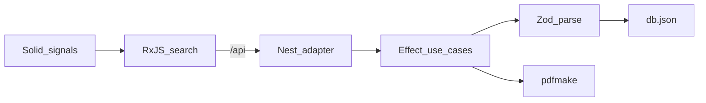
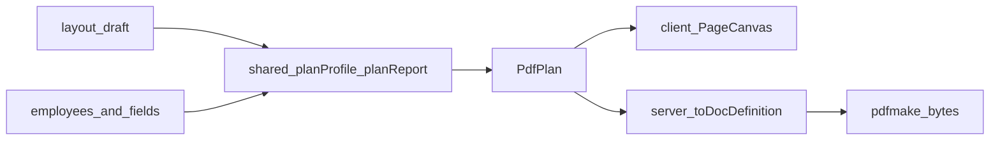
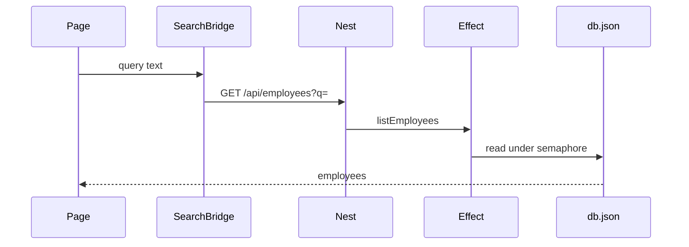
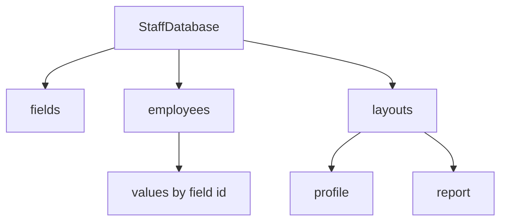
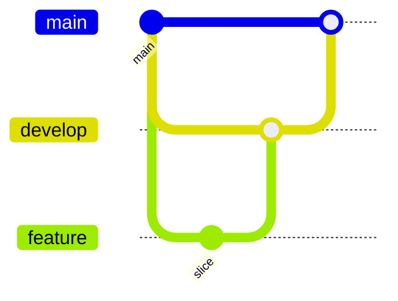
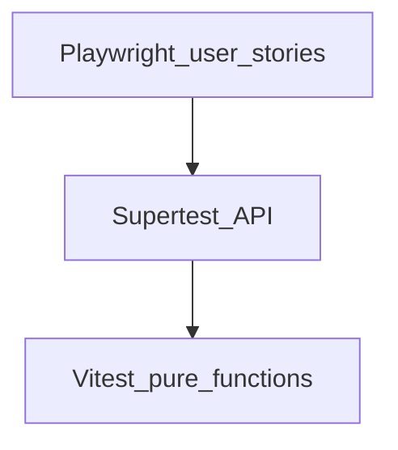

# Architecture

## Runtime

```mermaid
flowchart LR
  UI[Solid_signals] --> Rx[RxJS_search]
  Rx -->|/api| Nest[Nest_adapter]
  Nest --> Effect[Effect_use_cases]
  Effect --> Zod[Zod_parse]
  Zod --> DB[db.json]
  Effect --> PDF[pdfmake]
```

## PDF plan

```mermaid
flowchart LR
  Layout[layout_draft] --> Planner[shared_planProfile_planReport]
  Data[employees_and_fields] --> Planner
  Planner --> Plan[PdfPlan]
  Plan --> Canvas[client_PageCanvas]
  Plan --> Doc[server_toDocDefinition]
  Doc --> Bytes[pdfmake_bytes]
```

## Request flow

```mermaid
sequenceDiagram
  participant Page
  participant Bridge as SearchBridge
  participant API as Nest
  participant UseCase as Effect
  participant File as db.json
  Page->>Bridge: query text
  Bridge->>API: GET /api/employees?q=
  API->>UseCase: listEmployees
  UseCase->>File: read under semaphore
  File-->>Page: employees
```

## Data

```mermaid
flowchart TD
  Database[StaffDatabase]
  Database --> Fields[fields]
  Database --> Employees[employees]
  Database --> Layouts[layouts]
  Layouts --> Profile[profile]
  Layouts --> Report[report]
  Employees --> Values[values by field id]
```

## Git flow

```mermaid
gitGraph
  commit id: "main"
  branch develop
  checkout develop
  branch feature
  checkout feature
  commit id: "slice"
  checkout develop
  merge feature
  checkout main
  merge develop
```

## Test pyramid

```mermaid
flowchart TB
  E2E[Playwright_user_stories]
  API[Supertest_API]
  Unit[Vitest_pure_functions]
  E2E --> API
  API --> Unit
```
